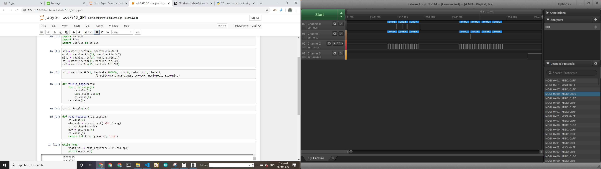

# Micropython Driver for ADE7816 Energy Monitor ASIC

This repository contains Micropython code to interface with
[ADE7816](https://www.analog.com/media/en/technical-documentation/data-sheets/ADE7816.pdf)\
Energy Monitor ASIC.

The demo code uses Jupyter notebook with [Micropython Kernel](https://github.com/goatchurchprime/jupyter_micropython_kernel)
to demonstrate development of a driver.

## Supported Hardware

This driver has been tested with the [ADE7816 Breakout](https://github.com/whatnick/ADE7816_Breakout)